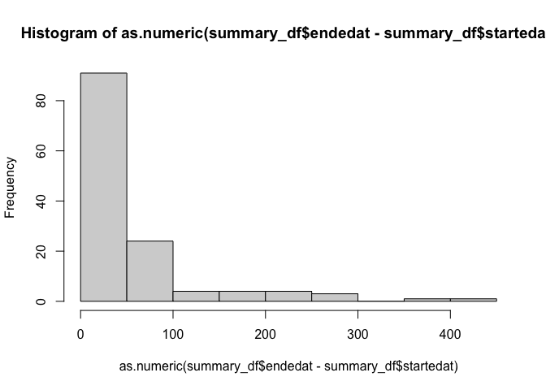

<!-- README.md is generated from README.Rmd. Please edit that file -->

# BiocBuildDB

<!-- badges: start -->
<!-- badges: end -->

This package simply provides a set of tools to work with the
Bioconductor build system reports and for creating structured data from
those reports.

The Bioconductor build system is a complex system that builds and checks
all Bioconductor packages on a regular basis. The build system produces
a large set of reports for each build and those reports are packaged up
in a `report.tgz` file. This package provides a set of tools to work
with those reports and to cache them locally for further analysis.

## Installation

You can install the development version of BiocBuildDB from
[GitHub](https://github.com/) with:

``` r
# install.packages("devtools")
devtools::install_github("seandavi/BiocBuildDB")
```

## Cache reports locally

This script will download all `new` reports from the Bioconductor build
system and store them in a local directory. It will also create a csv
file with the last modification date of each report.

``` r
library(BiocBuildDB)
dir.create('report_dir')
localize_all_new_reports('report_dir/last_mod_date.csv', 'report_dir')
```

## Work with a report.tgz file

Show an example of how to work with a report.tgz file.

``` r
library(BiocBuildDB)
report_tgz <- example_report_tgz()
report_dir <- untar_report_tgz(report_tgz)
summary_df <- get_build_summary_table(report_dir)
info_df <- get_info_table(report_dir)
prop_df <- get_propagation_status_table(report_dir)
```

Show the first few rows of each table.

``` r
head(summary_df)
#> # A tibble: 6 × 9
#>   package     node  stage version status startedat           endedat            
#>   <chr>       <chr> <chr> <chr>   <chr>  <dttm>              <dttm>             
#> 1 AHCytoBands nebb… buil… 0.99.1  OK     2024-01-17 10:31:13 2024-01-17 10:31:14
#> 2 AHCytoBands nebb… chec… 0.99.1  OK     2024-01-17 10:35:23 2024-01-17 10:35:31
#> 3 AHCytoBands nebb… inst… 0.99.1  OK     2024-01-17 10:30:08 2024-01-17 10:30:11
#> 4 AHEnsDbs    nebb… buil… 1.1.10  OK     2024-01-17 10:31:13 2024-01-17 10:32:01
#> 5 AHEnsDbs    nebb… chec… 1.1.10  OK     2024-01-17 10:35:23 2024-01-17 10:37:24
#> 6 AHEnsDbs    nebb… inst… 1.1.10  OK     2024-01-17 10:30:23 2024-01-17 10:30:49
#> # ℹ 2 more variables: command <chr>, report_md5 <chr>
colnames(summary_df)
#> [1] "package"    "node"       "stage"      "version"    "status"    
#> [6] "startedat"  "endedat"    "command"    "report_md5"
head(info_df)
#> # A tibble: 6 × 9
#>   Package  Version Maintainer MaintainerEmail git_url git_branch git_last_commit
#>   <chr>    <chr>   <chr>      <chr>           <chr>   <chr>      <chr>          
#> 1 AHCytoB… 0.99.1  Michael L… michafla at ge… https:… RELEASE_3… 821428c        
#> 2 AHEnsDbs 1.1.10  Johannes … johannes.raine… https:… RELEASE_3… 1cf652d        
#> 3 AHLRBas… 0.99.3  Koki Tsuy… k.t.the-answer… https:… RELEASE_3… c0e6555        
#> 4 AHMeSHD… 0.99.6  Koki Tsuy… k.t.the-answer… https:… RELEASE_3… 052e156        
#> 5 AHPathb… 0.99.5  Kozo Nish… kozo.nishida a… https:… RELEASE_3… a90bfd4        
#> 6 AHPubMe… 0.99.8  Koki Tsuy… k.t.the-answer… https:… RELEASE_3… f43d98f        
#> # ℹ 2 more variables: git_last_commit_date <dttm>, report_md5 <chr>
colnames(info_df)
#> [1] "Package"              "Version"              "Maintainer"          
#> [4] "MaintainerEmail"      "git_url"              "git_branch"          
#> [7] "git_last_commit"      "git_last_commit_date" "report_md5"
head(prop_df)
#> # A tibble: 6 × 4
#>   package       process propagate                                     report_md5
#>   <chr>         <chr>   <chr>                                         <chr>     
#> 1 AHCytoBands   source  UNNEEDED, same version is already published   f8fd2897c…
#> 2 AHEnsDbs      source  UNNEEDED, same version is already published   f8fd2897c…
#> 3 AHLRBaseDbs   source  NO, version to propagate (0.99.3) is lower t… f8fd2897c…
#> 4 AHMeSHDbs     source  NO, version to propagate (0.99.6) is lower t… f8fd2897c…
#> 5 AHPathbankDbs source  UNNEEDED, same version is already published   f8fd2897c…
#> 6 AHPubMedDbs   source  NO, version to propagate (0.99.8) is lower t… f8fd2897c…
colnames(prop_df)
#> [1] "package"    "process"    "propagate"  "report_md5"
```

Present a histogram of build times (in seconds) for the packages in the
example build report.

``` r
hist(as.numeric(summary_df$endedat - summary_df$startedat))
```


